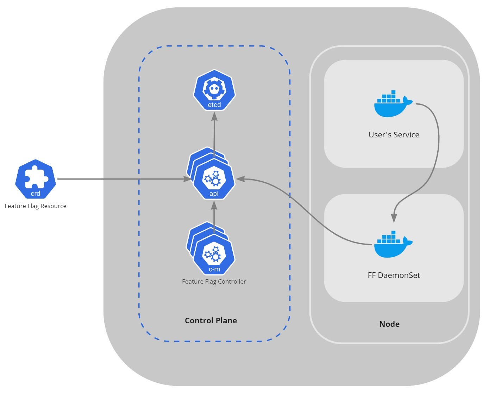

# OpenFeature Operator for Kubernetes

> ⚠️ Discussion around potential architectures have been moved [here](https://github.com/open-feature/research/issues/1). This repo will no longer be actively maintained.

The OpenFeature Operator for Kubernetes will make it easy to get started using
OpenFeature. The operator will be responsible for attaching a feature flag
evaluation engine sidecar process to a pod and propagating flag configurations.

## Planned Architecture

The architecture includes a control plane and containerized Feature Flag services.
The system is managed through [Custom Resource Definitions (CRDs)](https://kubernetes.io/docs/concepts/extend-kubernetes/api-extension/custom-resources/) or APIs,
which are both served by the control plane. The main components include:

- **Feature Flag Resource** is a custom CRD type that defines feature flags and evaluation logic for the system.
- **Control Plane** includes the Feature Flag controller services, `etcd` based storage,
  and API services that handle external requests and CRDs.
- **Feature Flag Service (_FF Service_)** provides feature flag management and
  evaluation to user applications. It can run as a sidecar container, a
  DaemonSet, or as a standalone service, depending on the user application architecture.

There may be an additional operator service inside or outside the control plane that
manages the system and integrates _Feature Flag Resource_ submissions to its
system management using an approach like GitOps.

Sidecar container architecture:

DaemonSet architecture:

Service architecture:

